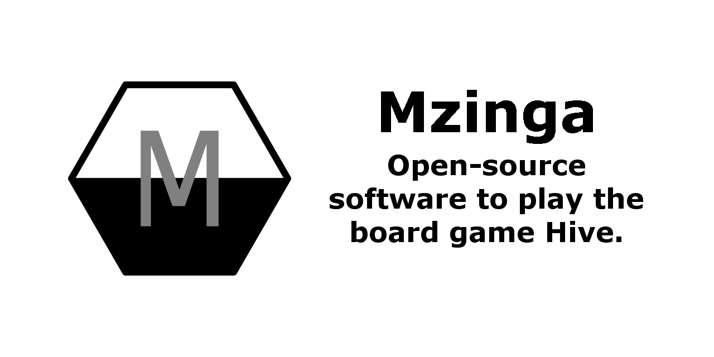

# Mzinga #

Mzinga is a collection of open-source software to play the board game [Hive](https://gen42.com/games/hive), with the primary goal of building a community of developers who create Hive-playing AIs.

To that end, Mzinga proposes a [Universal Hive Protocol](https://github.com/jonthysell/Mzinga/wiki/UniversalHiveProtocol) to support interoperability for Hive-playing software.

For more information on Mzinga and its projects, please check out the [Mzinga Wiki](https://github.com/jonthysell/Mzinga/wiki).

## Installation ##

Mzinga was written in C# and should run anywhere that supports [.NET 5.0](https://github.com/dotnet/core/blob/master/release-notes/5.0/5.0-supported-os.md). It has been officially tested on:

* Windows 10
* Ubuntu 20.04
* macOS 10.15

### Windows ###

#### Standard ####

The Windows release provides self-contained x86/x64 binaries which run on Windows 7 SP1+, 8.1, and 10.

1. Download the latest Windows zip file (Mzinga.Win32.zip *or* Mzinga.Win64.zip) from https://github.com/jonthysell/Mzinga/releases/latest
2. Extract the zip file

**Note:** If you're unsure which version to download, try Mzinga.Win64.zip first. Most modern PCs are 64-bit.

#### Microsoft Store ####

A standalone version of *MzingaViewer* is available via the Microsoft Store: https://www.microsoft.com/en-us/p/mzingaviewer/9pm7p224hpgq

**Note:** This version does not contain the *MzingaEngine*, *MzingaPerft*, or *MzingaTrainer* binaries and is provided for Windows 10 users restricted to running Store applications.

### MacOS ###

The MacOS release provides self-contained x64 binaries which run on OSX >= 10.13.

1. Download the latest MacOS tar.gz file (Mzinga.MacOS.tar.gz) from https://github.com/jonthysell/Mzinga/releases/latest
2. Extract the tar.gz file

### Linux ###

The Linux release provides self-contained x64 binaries which run on many Linux distributions.

1. Download the latest Linux tar.gz file (Mzinga.Linux.tar.gz) from https://github.com/jonthysell/Mzinga/releases/latest
2. Extract the tar.gz file

### Portable ###

The Portable release provides loose, framework-dependent .NET 5 binaries.

1. Install the latest [.NET Runtime](https://dotnet.microsoft.com/download/dotnet/5.0)
2. Download the latest Portable zip file (Mzinga.Portable.zip) from https://github.com/jonthysell/Mzinga/releases/latest
3. Extract the zip file

## Copyright ##

Hive Copyright (c) 2016 Gen42 Games. Mzinga is in no way associated with or endorsed by Gen42 Games.

Mzinga Copyright (c) 2015-2021 Jon Thysell.

Avalonia Copyright (c) .NET Foundation and Contributors.

MVVM Light Toolkit Copyright (c) 2009-2018 Laurent Bugnion.
